# Deep

Kotlin Multiplatform (KMP) application with Clean Architecture and MVI pattern. Supports Android and
iOS platforms.

## Architecture

### Modular Structure

```
├── composeApp/              # Shared Compose UI entry point
├── core/                    # Core modules
│   ├── presentation/        # MVI base classes, utilities
│   ├── domain/              # Domain errors, utilities, Result<T, Error>
│   ├── data/                # Network, logging
│   ├── database/            # Room database
│   ├── security/           # Token storage (Keystore/Keychain)
│   └── designsystem/        # UI components, theme
├── feature/                 # Feature modules
│   ├── auth/                # Authentication (login/logout)
│   │   ├── presentation/
│   │   ├── domain/
│   │   └── data/
│   └── scan/                # Scan list, bathymetry
│       ├── presentation/
│       ├── domain/
│       └── data/
└── build-logic/             # Convention plugins
```

Each feature follows **Clean Architecture** with three layers:

- **Presentation** - UI, ViewModels, MVI pattern
- **Domain** - Use cases, repositories interfaces, models
- **Data** - Repository implementations, API, local database

### MVI Pattern

Custom MVI implementation with:

- `BaseStore<I, S, E>` - Core store logic (thread-safe, lifecycle-aware)
- `MviViewModel` - Android ViewModel wrapper
- `Reducer<S, I>` - Pure state transformations
- `Middleware<I, S, E>` - Side effects (API calls, navigation)

Key features:

- Type-safe DSL for reducers
- Optional `initialIntent` for auto-initialization
- State observation via `StateFlow`
- Effects via `SharedFlow` (one-time events)
- **Sealed interface states** - invalid states are unrepresentable

### Result<T, Error> Pattern

Type-safe error handling across all layers:

```kotlin
sealed interface Result<out D, out E : Error> {
    data class Success<out D>(val data: D) : Result<D, Nothing>
    data class Failure<out E : Error>(val error: E) : Result<Nothing, E>
}
```

- All storage operations return `Result<T, StorageError>`
- All API operations return `Result<T, DataError.Remote>`
- Transformations via `map()`, `onSuccess()`, `onFailure()`

## Security Architecture

### Token Storage (`core:security`)

Platform-specific secure storage implementation:

```
┌─────────────────────────────────────┐
│         TokenStorage                │
│  (interface - pure abstraction)     │
├─────────────────────────────────────┤
│  • hasToken(): Result<Boolean>      │
│  • saveToken(): Result<Unit>        │
│  • getToken(): Result<String>       │
│  • clearToken(): Result<Unit>       │
└─────────────────────────────────────┘
              ↓ implements
┌─────────────────────────────────────┐
│    AndroidTokenStorage              │
│    • AES-256/GCM encryption         │
│    • Android Keystore key management│
└─────────────────────────────────────┘
              
┌─────────────────────────────────────┐
│    IOSTokenStorage                  │
│    • Keychain Services              │
│    • kSecAttrAccessibleWhenUnlocked │
└─────────────────────────────────────┘
```

### Error Hierarchy

```kotlin
// Storage layer (core:security)
sealed interface StorageError : Error {
    object NotFound
    class EncryptionFailed(cause: Throwable)
    class DecryptionFailed(cause: Throwable)
    class IOError(cause: Throwable)
}

// Domain layer (core:domain)
sealed interface DataError : Error {
    sealed interface Remote : DataError
    sealed interface Local : DataError
    sealed interface Validation : DataError
}
```

## Authentication Flow

### App-Level State Management

```kotlin
// Sealed interface - invalid states are unrepresentable
sealed interface AppState : UiState {
    data object Initializing : AppState      // Checking auth
    data object Authenticated : AppState    // Token exists
    data object Unauthenticated : AppState    // No token
}
```

### Auth Flow Diagram

```
App Start
   │
   ▼
AppState.Initializing ───► SplashScreen
   │
   │ LaunchedEffect(CheckAuth)
   ▼
AppMiddleware ───► TokenStorage.hasToken()
   │
   ├─► Success(true) ───► AuthState.Authenticated ───► MainNav
   │
   └─► Success(false) ───► AuthState.Unauthenticated ───► AuthNav
   │
   └─► Failure ───► AuthState.Unauthenticated (safe fallback)

Login Flow:
   │
   ▼
LoginScreen ───► LoginUseCase
   │
   ▼
AuthRepository.login()
   │
   ├─► 1. Save user to DB
   ├─► 2. Save token via TokenStorage
   │   └─► Failure? Rollback user (atomic operation)
   │
   └─► 3. Save scans
   │
   ▼
LoginEffect.Navigate ───► AppViewModel ───► AppState.Authenticated

Logout Flow:
   │
   ▼
MainNav ───► LogoutUseCase
   │
   ▼
AuthRepository.logout()
   │
   ├─► 1. Clear users from DB
   ├─► 2. Clear token from TokenStorage
   │
   ▼
AppState.Unauthenticated ───► AuthNav
```

### Key Principles

1. **Single source of truth** - Token existence determines auth state
2. **Atomic operations** - Login is all-or-nothing (rollback on failure)
3. **Safe fallbacks** - Any error = unauthenticated state
4. **No callbacks** - Navigation via state observation only

## CI/CD

GitHub Actions workflow (`.github/workflows/ci.yml`):

- Runs on push to `main`, `develop` and PRs
- Executes `ScanListReducerTest` unit tests
- Requires `API_KEY` secret in GitHub repository settings

## Configuration

### API Key

API key is injected via **BuildKonfig** at build time:

1. Create `local.properties` in project root:

```properties
sdk.dir=/path/to/android/sdk
API_KEY=your_api_key_here
```

2. For CI, add `API_KEY` to GitHub Secrets:
    - Repository → Settings → Secrets and variables → Actions → New repository secret

## Testing

### Unit Tests

Located in `src/commonTest/kotlin`:

- `ScanListReducerTest` - Reducer state transformations

Run locally:

```bash
./gradlew :feature:scan:presentation:testDebugUnitTest
```

### UI Tests

Located in `src/androidInstrumentedTest/kotlin`:

- `ScanListScreenTest` - Compose UI tests

Requires Android emulator or device.

## Build & Run

### Android

```bash
./gradlew :composeApp:assembleDebug
```

Or use run configuration in Android Studio.

### iOS

Open `/iosApp` in Xcode and run, or use run configuration in Android Studio.

## Security

- **Tokens**: AES-256/GCM encryption (Android) / Keychain (iOS)
- **Keystore**: Hardware-backed when available
- **Keychain**: `kSecAttrAccessibleWhenUnlockedThisDeviceOnly`
- **Rollback**: Atomic login with user cleanup on token storage failure
- **Logout**: Clears all user data + secure token
- **API keys**: Excluded from version control via BuildKonfig
- **Error handling**: Type-safe Result<T, Error> - no silent failures

## Tech Stack

- **Kotlin**: 2.2.0
- **UI**: Compose Multiplatform 1.10.1, Material3
- **DI**: Koin 4.1.1
- **Database**: Room KMP 2.8.4
- **Network**: Ktor 3.3.1
- **Security**: Android Keystore, iOS Keychain, AES-256/GCM
- **Serialization**: kotlinx.serialization 1.9.0
- **Time**: kotlin.time (Kotlin 2.2.0+)
- **Navigation**: JetBrains Navigation 2.9.2
- **Build**: Gradle Convention Plugins

## Screenshots

### Login

<p align="center">
  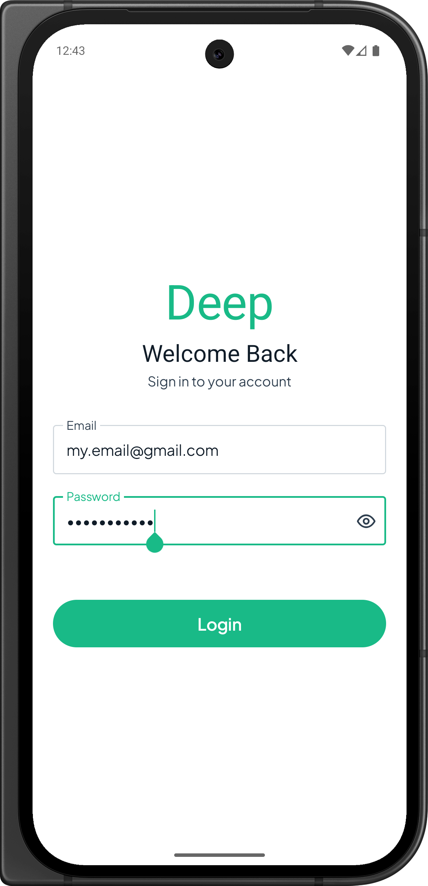
  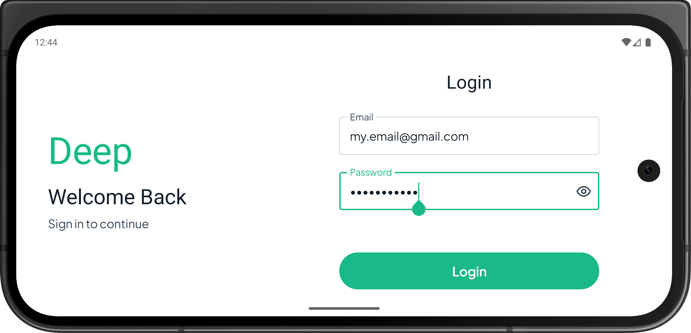
  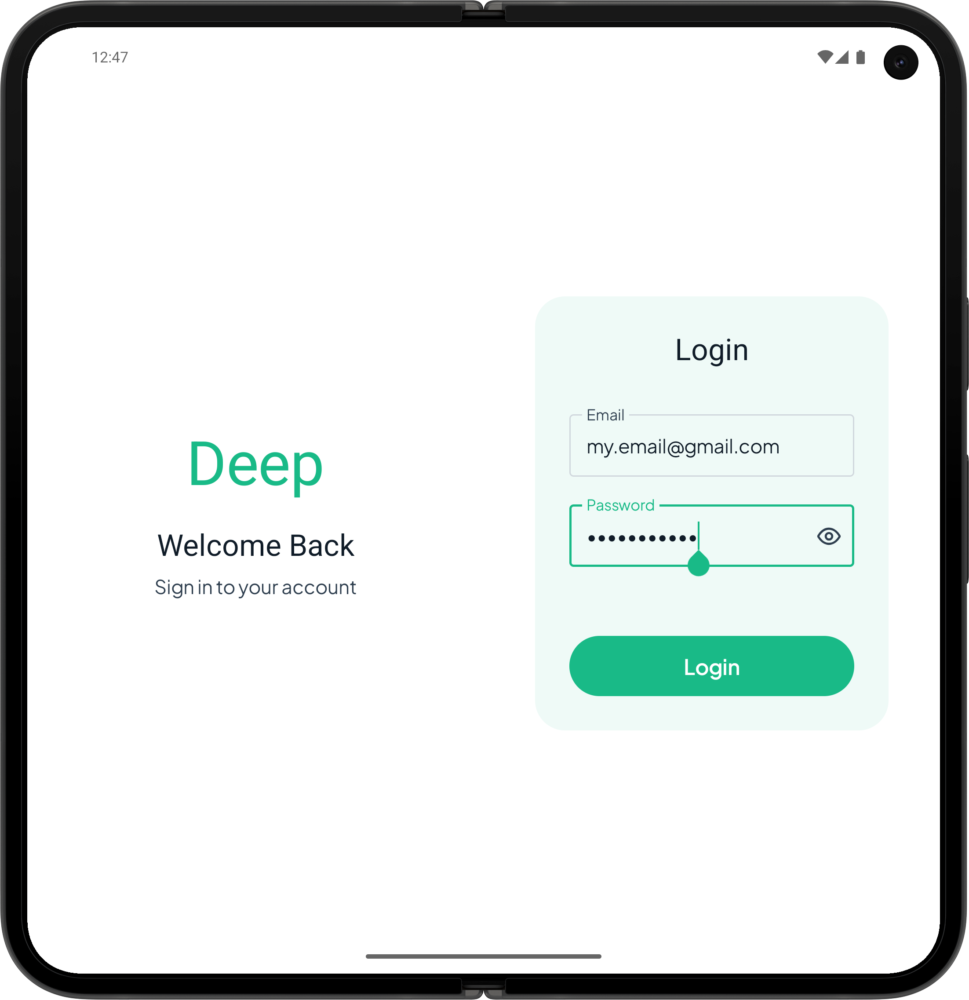
  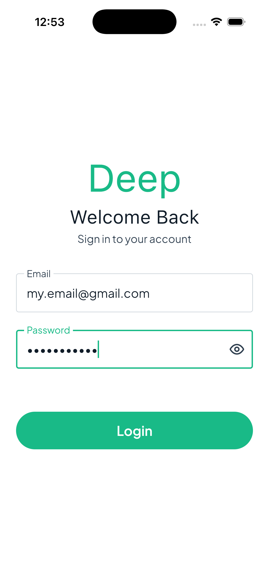
  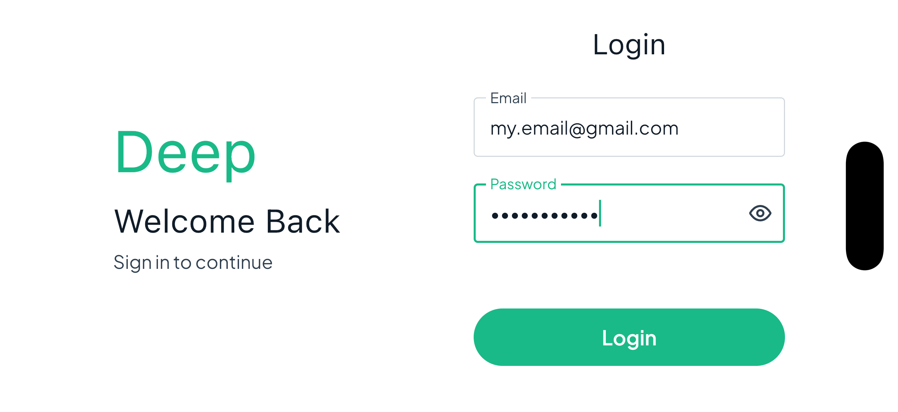
  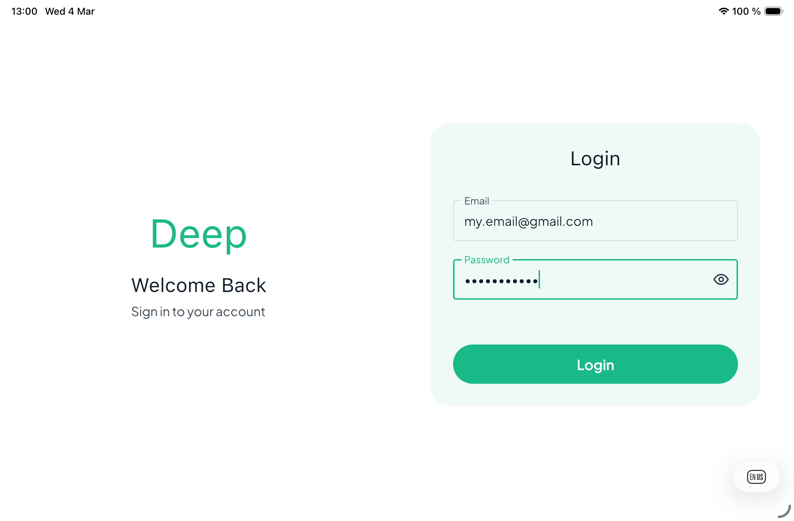
</p>

### Scan List

<p align="center">
  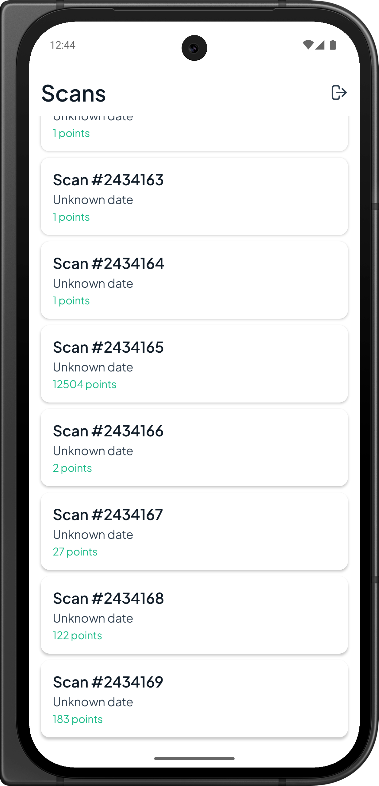
  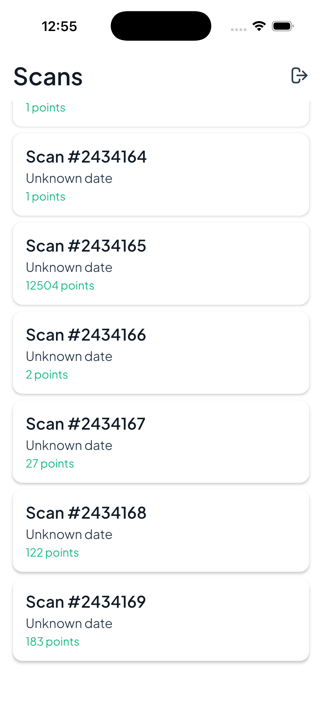
</p>

### Bathymetry

<p align="center">
  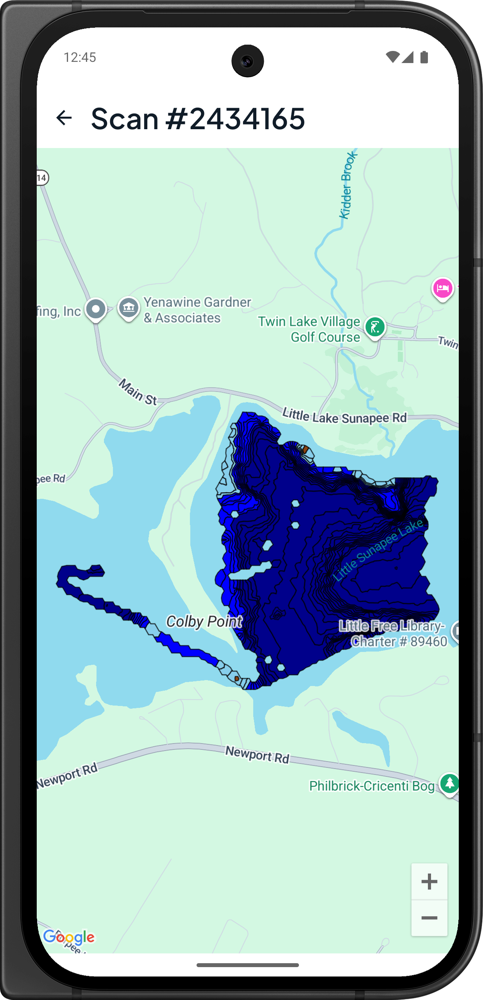
  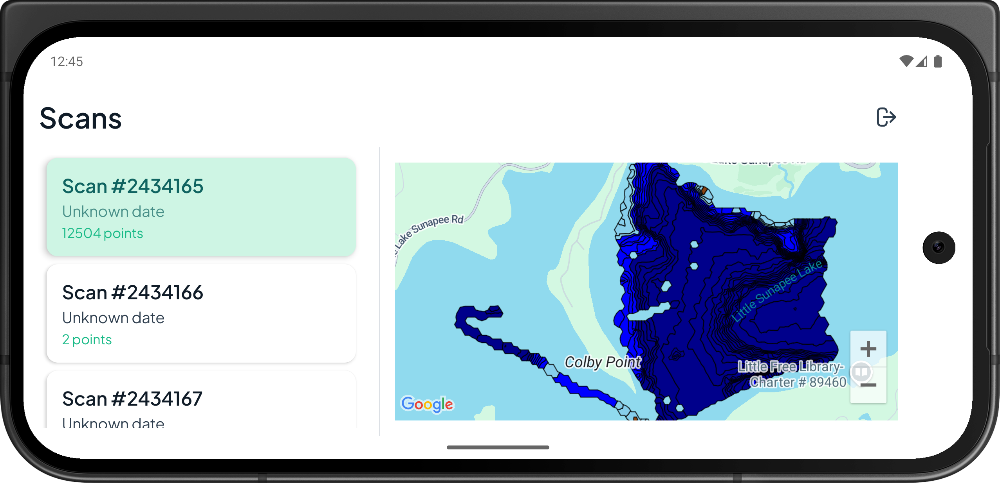
  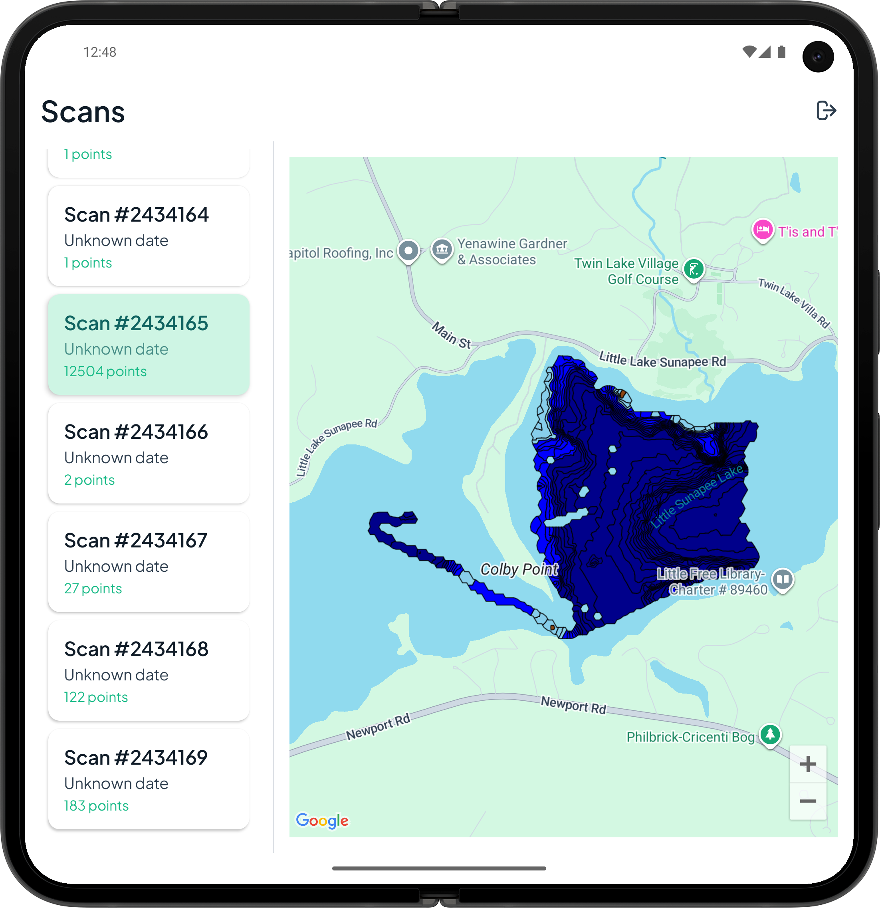
  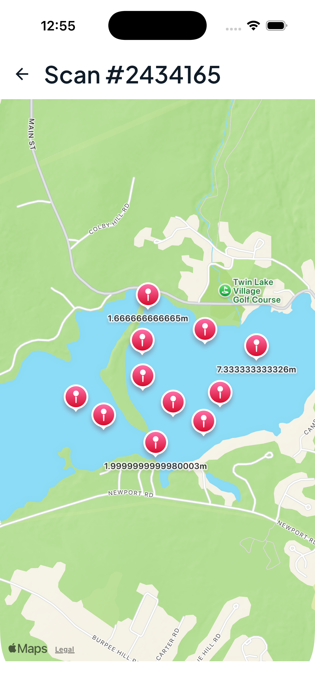
  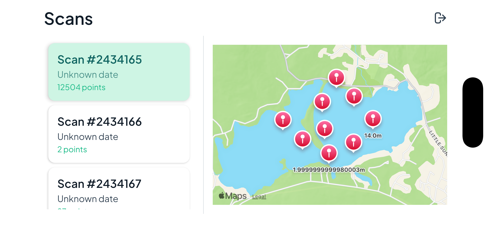
  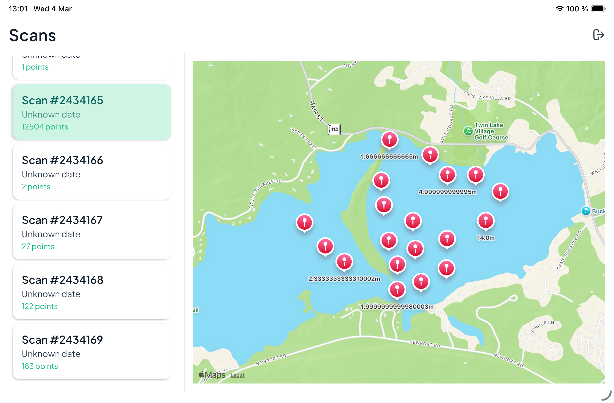
</p>
